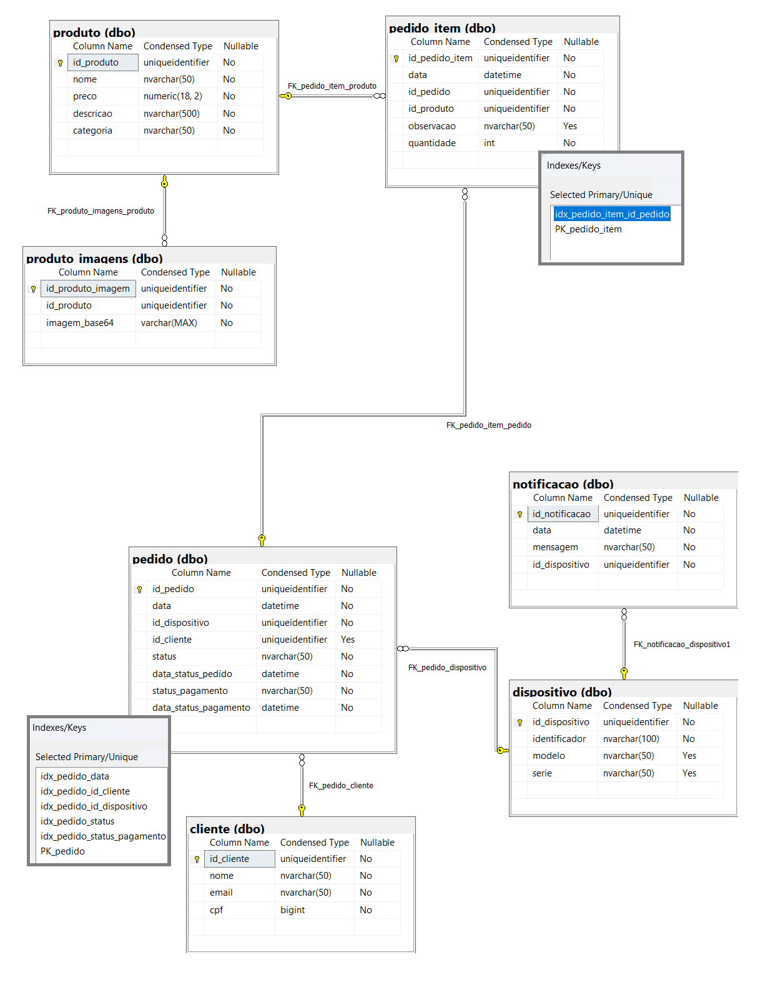

# FIAP-Pos-Tech-Challenge-Infra-Bd
FIAP Pos Tech Challenge Infraestrutura Banco de dados

Micosoft SQL Server foi nosso banco de dados escolhido.

- Foram criados index para melhora da performance do banco de dados.

- O SQL Server é amplamente reconhecido por sua confiabilidade, desempenho robusto e escalabilidade, tornando-o ideal para empresas que precisam gerenciar grandes volumes de dados com alta eficiência.
Os recursos de alta disponibilidade, como failover clustering e replicação, garantem continuidade de operações, e o suporte a transações ACID assegura a integridade e consistência dos dados.
Além disso, o SQL Server oferece uma arquitetura otimizada para consultas complexas e cargas pesadas, proporcionando respostas rápidas mesmo em cenários críticos. Outro diferencial do SQL Server é sua
integração nativa com o ecossistema Microsoft, como Power BI, Excel e Azure, facilitando a análise e visualização de dados. A segurança também é um ponto forte, com funcionalidades como criptografia,
controle granular de permissões e auditoria. Essa combinação de segurança avançada, desempenho e integração o torna uma solução confiável e eficiente para organizações que buscam um banco de dados robusto
e preparado para aplicações críticas. Com isso, o SQL Server se posiciona como uma solução confiável e eficiente para empresas que demandam alto desempenho, segurança e integração com sistemas de Business
Intelligence e análise de dados.

# Diagrama entidade relacionamento (DER)

