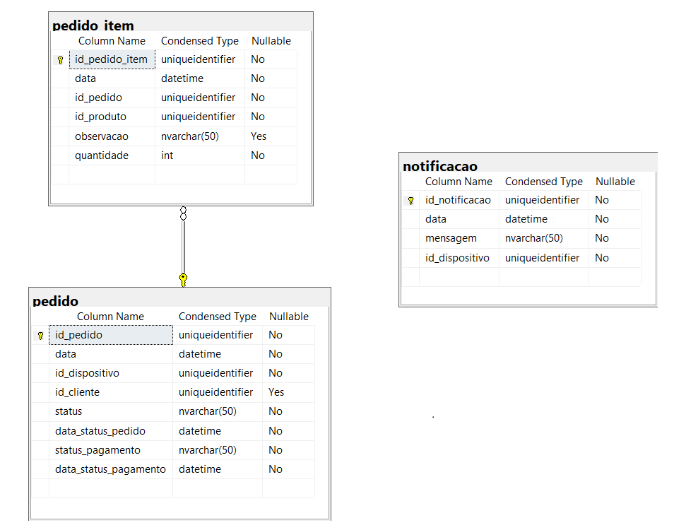
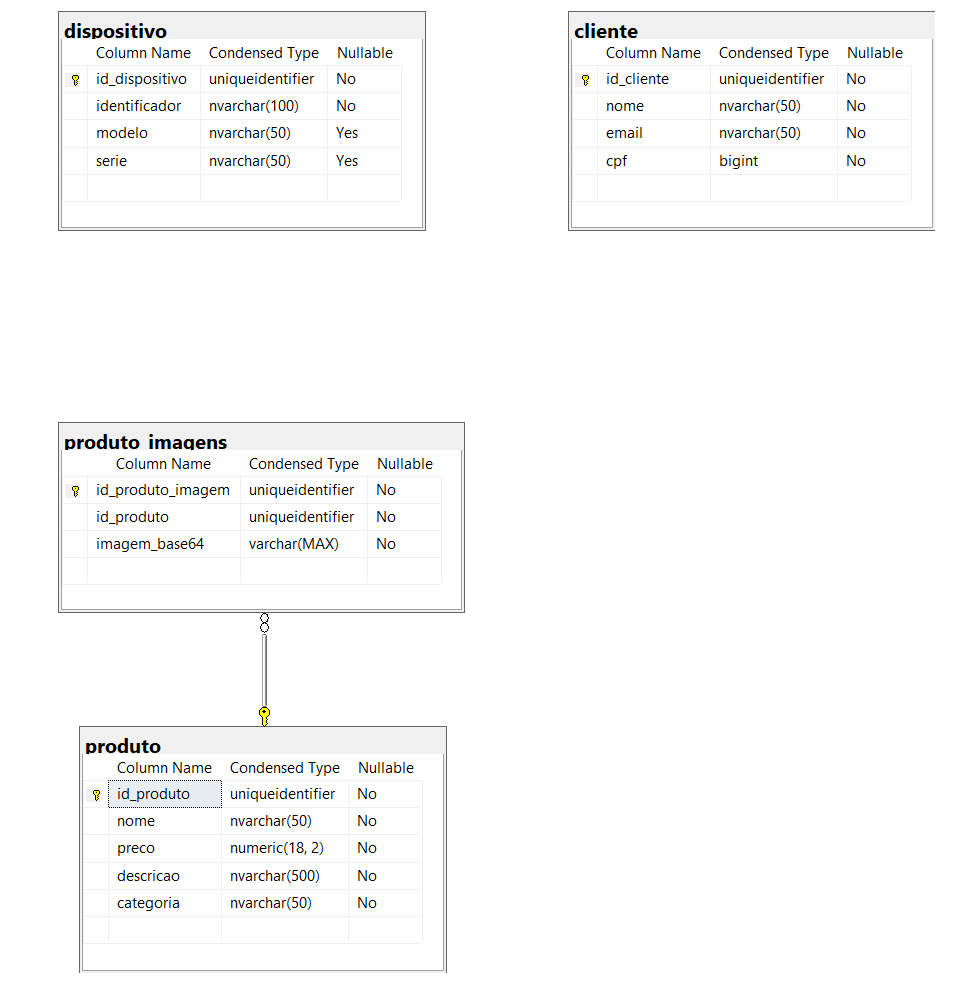
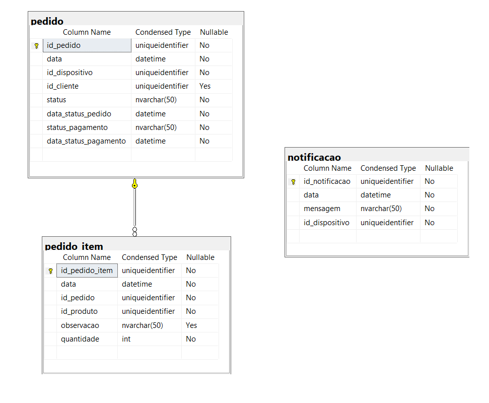
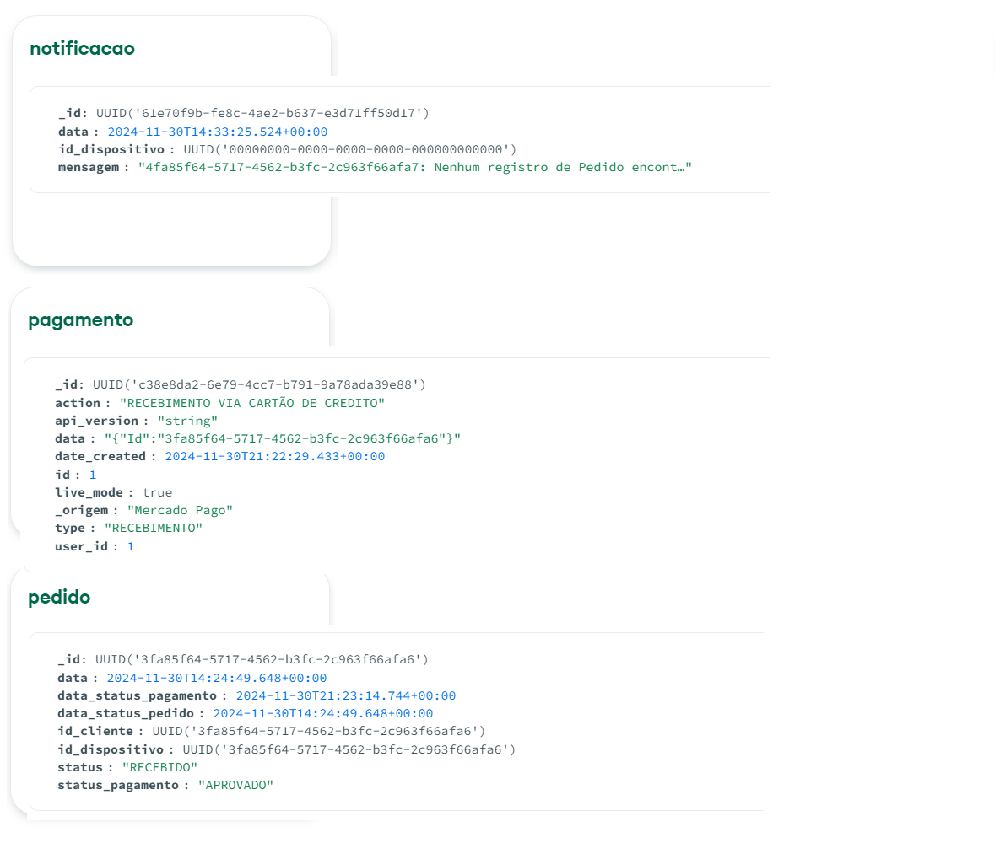

# FIAP-Pos-Tech-Challenge-Infra-Bd
FIAP Pos Tech Challenge Infraestrutura Banco de dados

# Diagrama entidade relacionamento (DER)

### Micro serviço de pedido :: Microsoft SQL Server 2019 (SQL)

### Micro serviço de cadastro :: Microsoft SQL Server 2019 (SQL)

### Micro serviço de produção :: Microsoft SQL Server 2019 (SQL)

### Micro serviço de pagamento :: MongoDb (NoSql)

